# Sophos XG Firewall Home Edition with VMware ESXi for Small Businesses

This guide will walk you through installing your first ESXi server and creating your first virtual machine (VM) with all the necessary configurations (Part 1). 

Afterward (Part 2) & (Part 3), we’ll dive into configuring **Sophos XG Firewall Home Edition** on your ESXi server.

Knowing that this solution is designed for small businesses with up to 50 employees, offering essential network security, control, and monitoring features. It's ideal for environments where performance demands are moderate, given the specific hardware limitations of **Sophos XG Firewall Home Edition**:

- 4 CPU cores
- 6GB of RAM

### Key Use Case

For a small office with around 10 employees using standard internet services, you may require a firewall to ensure basic network security, monitoring, VPN capabilities, and perhaps remote access. By virtualizing **Sophos XG Firewall Home Edition** within a VMware ESXi server, you can also integrate other services like file sharing and backups into a single physical machine, optimizing both space and cost.

### **Requirements:**

- ISP Router
- Server with at least 500gb to 1TB storage  and 16GB Ram with x2 NICs Network Card
- VMware ESXi software (Installed on your PC)
- Sophos XG Firewall Home Edition and windows Server ISO Image
- Additional Switch or access point (This is used to connect your LAN clients according to your needs)

### Example Network Topology

The topology illustrates a small network setup that incorporates two virtual machines on the ESXi server:

1. **Sophos XG Firewall Home Edition**
2. **Windows Server 2012** (optional for domain, file sharing, or backup services)

The red and green dotted lines in the diagram refer to the **virtual network connections** inside ESXi:

- **Red Dotted Line**: Represents the virtual link in the WAN zone, connecting the **Sophos XG** firewall to the ISP router (configured in modem-only mode). This serves as the internet (WAN) source.
- **Green Dotted Line**: Represents the internal virtual interface for the LAN zone, connecting the **Sophos XG** firewall with the internal network through a virtual LAN.

The ESXi server itself will have two physical NICs (network interfaces Ports):

- **One NIC (Port A)** will manage the LAN connection for internal devices.
- **The second NIC (Port B)** will handle the WAN connection for internet access.

Additionally, **Sophos XG Firewall** requires **two virtual links** inside ESXi—one for the WAN interface and one for the LAN interface—to route traffic effectively between the external internet and the internal network. The **vSwitches** (virtual switches) and NICs are set up within ESXi to facilitate these connections and can be customized based on your specific network design.

1. **Physical Network (LAN)**: The firewall connects to the internal network through a **physical switch** (referred to as "Real Switch" in the diagram). This switch will connect your client devices, and any wireless access points.

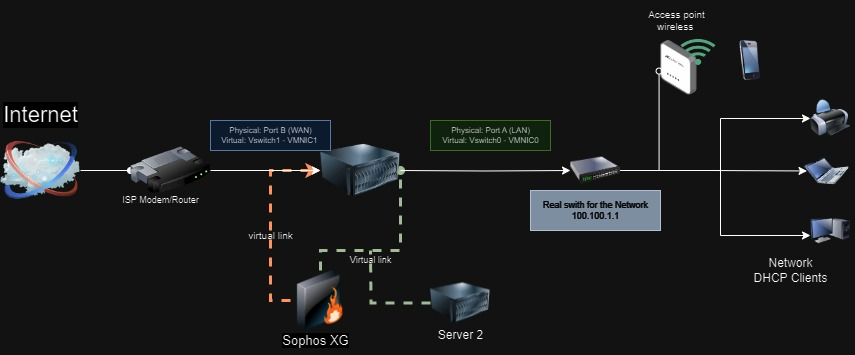

### Considerations for Sophos XG Home Edition

This setup works well for low to moderate traffic networks, but **not recommended for high-traffic environments** due to the resource limitations of the **Sophos XG Home Edition**.

For more information you could check sophos from this link

https://community.sophos.com/sophos-xg-firewall/f/recommended-reads/137737/sophos-firewall-home

## **Part 1 : Installations and Configuration for ESXI and Sophos XG Home Edition**

> note if you already do it you could pass “**Part 1**”
> 

### **Step 1: Check Hardware Compatibility**

Before installing ESXi, ensure that your PC meets the minimum hardware requirements:

- Processor 6 Cores (Intel or AMD)
- At least 8 GB of RAM (16 GB or more recommended).
- A  network card with at least 2 ports (NICs) supported by ESXi
- A hard drive with at least 10 GB of free space

### **Step 2: Create a Bootable USB Drive**

1. Download the **ESXi ISO** and **Rufus**.
2. Use **Rufus** to create a bootable USB drive.
3. Boot from the USB and install **ESXi** on your server.
4. Reboot after installation.

### **Step 3: Configure ESXi**

1. After the reboot, you’ll see the **ESXi Direct Console User Interface (DCUI)**.
2. Log in with root credentials using F2.
    
    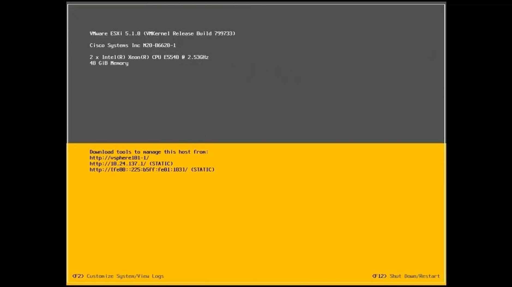
    
3. Navigate to **Configure Management Network** and set the following:
    - **Network Adapters**: Ensure the correct NIC is selected.
        
        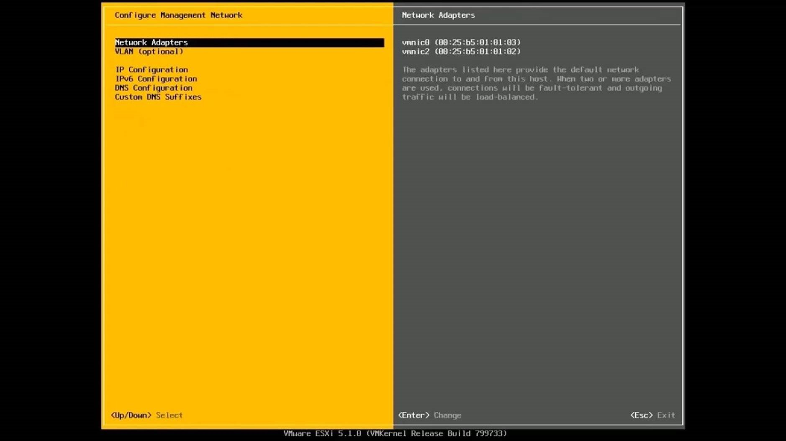
        
    - **IPv4 Configuration**: Set a static IP address for the ESXI.
        
        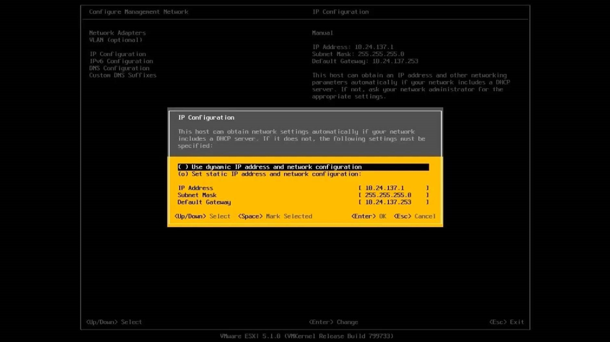
        
4. Press **Esc** to apply the changes and restart the management network.

### **Step 4: Access ESXi Web Interface**

1. From another PC on the same network, configure its IP within the same range, then access `https://<ESXi-IP>` in a browser and log in using the root credentials.
    
    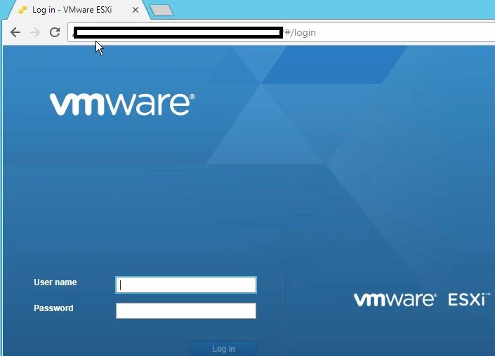
    
2. NOW you can create and manage virtual machines.

### **Step 5: Create Your First Virtual Machine**

1. In the web interface, click **Create/Register VM**.
2. Name the VM, choose **Linux** as the OS, and allocate resources.
3. Attach the **Sophos XG ISO** to the VM.

### **Step 6: Configure the VM Settings**

1. **Select Storage**: Choose the datastore where you want to store the VM's files.
2. **Customize the hardware**:
    - Set the number of CPUs and RAM according to Sophos XG Firewall Home Edition requirements (4 cores, 6 GB RAM).
    - **Add two network adapters** (one for WAN, one for LAN). Make sure to uncheck **"Connect at power on"** for now.
    - Attach the **Sophos XG ISO** file to the CD/DVD drive by selecting the ISO under **Datastore ISO file**.
3. Once all settings are configured, click **Next**, then **Finish**.

### **Step 7: Start the VM and Install Sophos XG Firewall and Finalize Installation**

1. Select your newly created VM from the list and click **Power On**.
2. Open the console of the VM by clicking **Console** to access the installation.
3. Follow the on-screen instructions to install **Sophos XG Firewall**. The installation process will begin, and depending on the storage size, it might take some time.
4. Power off the VM, remove the ISO, and reboot.

### **Step 8: Configure Network Settings**

1. After logging into the firewall, press **1** for **Network Configuration**.
    
    [1520613044825.jfif](1520613044825.jfif)
    
2. Press **1** again for **Interface Configuration** and configure the LAN IP address for **Port 1** (LAN).
3. If the WAN interface has a DHCP IP assigned, you can proceed. If not, reset the modem/router and check the WAN interface again.

### **Step 9: Access the Web-Based GUI**

1. Open your browser and go to `https://<LAN-IP>:4444`.
2. Log in using **admin/admin**.
3. Follow the setup wizard to confirm your license (ensure an active internet connection via the WAN. interface).
4. After the wizard completes and applies the configuration changes, reload the GUI to access the dashboard, which should now be visible.
    
    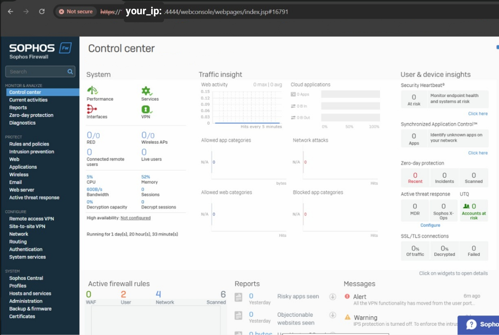
    

Now, your **Sophos XG Firewall Home Edition** is ready and accessible through the web GUI, where you can manage and configure your firewall settings.

For More information 

https://masteringvmware.com/esxi-6-5-web-client-in-depth-overview/

https://docs.vmware.com/en/VMware-vSphere/8.0/vsphere-esxi-host-client/GUID-00DDC20B-3D74-4A15-8D42-065969DD0806.html

## **Part 2 ESXI Network Configuration**

We will now configure the network for our ESXi setup.

### Step 1: Configure Port Groups

1. Navigate to **Networking** > **Port Groups**. By default, you will see “VM Network” and “Management Network.”
2. Click on **VM Network**.

At this point, we will group all VMs under "VM Network" and attach them to **vSwitch0** (the default virtual switch), which will connect to the physical LAN port (**vmnic0**). Ensure that **vSwitch0** is only connected to **vmnic0**, as it may default to all available physical ports.

### Step 2: Configure Virtual Switches

1. Go to **Networking** > **Virtual Switches**. You should see **vSwitch0** by default.
2. Confirm that **vSwitch0** is attached only to **vmnic0** (LAN Port). If **vmnic1** (WAN Port) is attached, remove it via **Edit Settings**.

Now, **vSwitch0** connects your virtual machines (e.g., Sophos XG) to **vmnic0** (LAN Port) only.

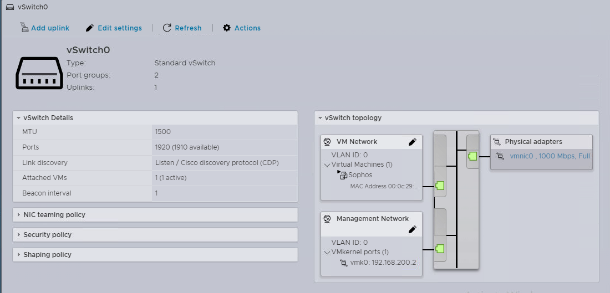

### Step 3: Add a New Virtual Switch (vSwitch1)

1. In **Networking**, click **Virtual Switches**, then **Add Standard Virtual Switch**.
2. Name the switch **vSwitch1**, and set **Uplink 1** to **vmnic1** (WAN Port). Click **Add**.

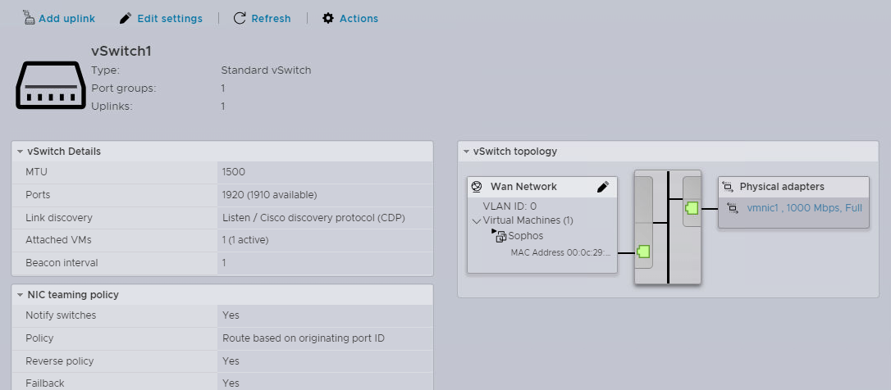

### Step 4: Create a WAN Port Group

1. Go to **Networking** > **Port Groups**, then click **Add Port Group**.
2. Name the port group **WAN Network**, and select **vSwitch1** as the virtual switch. Click **Add**.

### Step 5: Configure Network Adapters for Sophos VM

1. Navigate to **Virtual Machines** > **Sophos**, then click **Edit**.
2. If there’s only one network adapter connected to the **VM Network**, add a second adapter by clicking **Add Network Adapter**.
3. For the second adapter, select **WAN Network** from the port group options.

### Final Configuration

Your Sophos VM should now be connected to:

1. **VM Network** (connected to **vmnic0** - LAN Port) through **vSwitch0**.
2. **WAN Network** (connected to **vmnic1** - WAN Port) through **vSwitch1**.

## **Part 3 Sophos XG Configuration**

First, we need to focus on two key tasks:

1. **Configure Sophos XG Firewall Rules**: Set up firewall policies tailored to your network requirements, including traffic control, security settings, and application rules.
2. **Set Sophos XG as DHCP Server**: Configure the Sophos XG Firewall to serve as the DHCP server for the network, managing IP assignments dynamically.

and now lets talk about DHCP in Sophos 

- Navigate to the "Network" tab (Under CONFIGURE at the left panel)
- Click on "Network" and then "Interfaces" as shown in the image below
    
    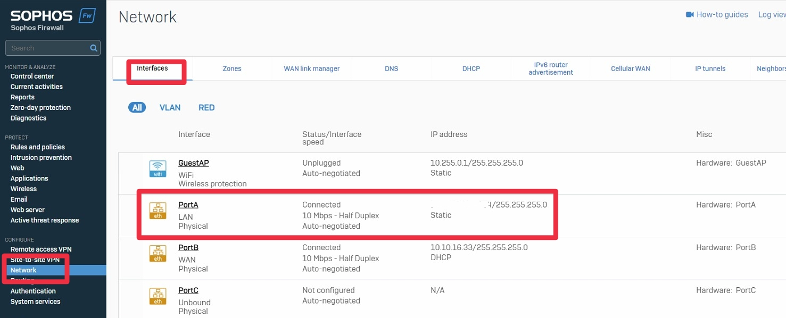
    

- PortA should be connected (**LAN**) and with the same ip of Sophos which is static
- Click on "Network" and then "DHCP" then “Add” to create new DHCP as shown in the image below

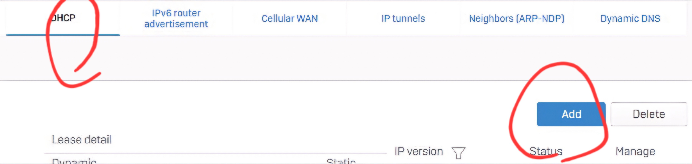

- Under the DHCP server section click on "Add" where you will be taken to another page to enter your DHCP pool settings. Enter your settings accordingly but be mindful of any addresses already issued on your network.
    
    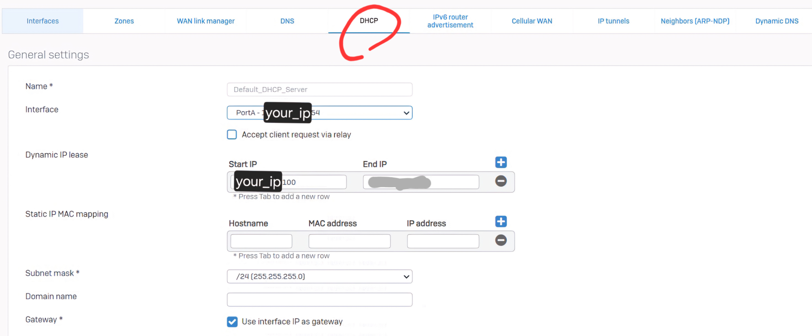
    
- Don't forget YOUR DNS Server Too
    
    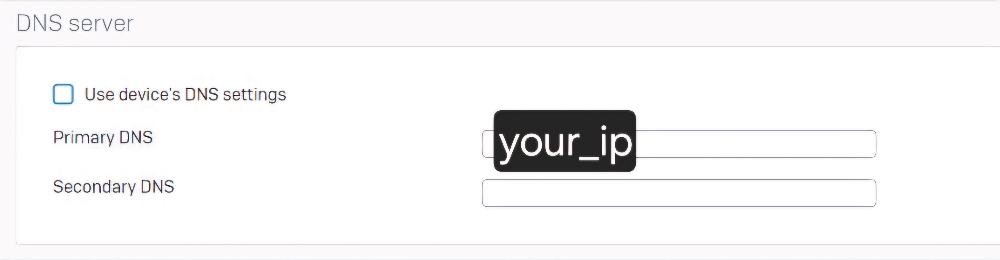
    

After applying all three configuration steps, your network should have full connectivity, and clients will be able to obtain a new DHCP address from the Sophos XG Firewall. All internal traffic will now pass through the firewall, adding an additional layer of security. You can now customize the firewall settings to meet your specific needs.

If you have any questions, feel free to reach out me here or refer to the Sophos community or VM Ware community for further assistance.

You can also connect with me on Twitter: @hegazy_96.